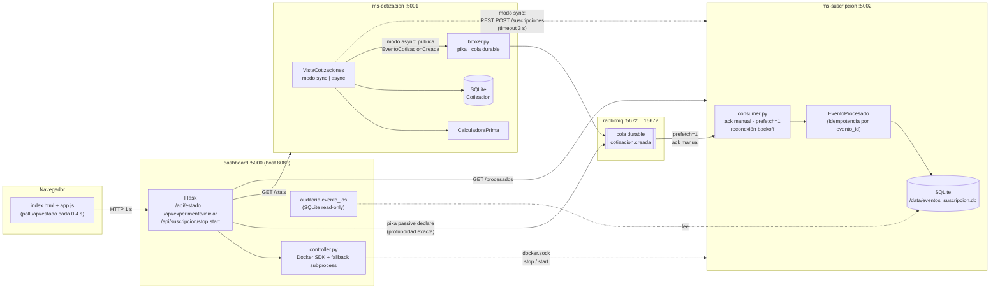
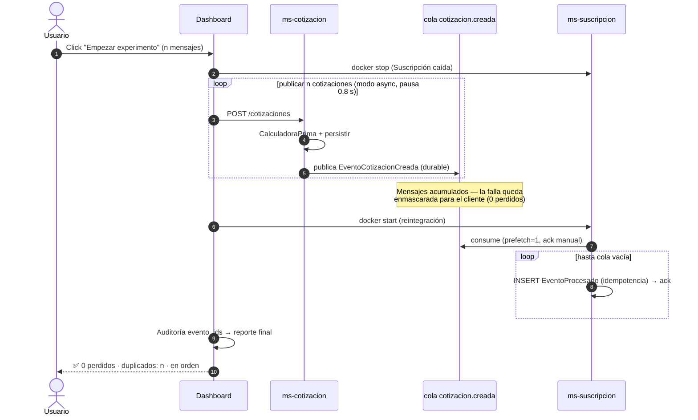

# Experimento Broker Interactivo — Arquitecturas Ágiles (MISW 202602)

Experimento interactivo que demuestra que un broker de mensajería (RabbitMQ) **enmascara la falla** del microservicio Suscripción (HU ASR-DIS-02, disponibilidad ≤ 5 s):

- Cuando Suscripción está **caído**, Cotización sigue operando y los eventos `cotizacion.creada` se **acumulan en una cola durable**.
- Al **reintegrar** Suscripción, todos los eventos se procesan y **ningún evento se pierde** (perdidos = 0 por auditoría de `evento_id`).
- Un **dashboard web** orquesta y observa toda la secuencia en vivo, impulsada por **estado real** (sin contadores simulados).

> **Crédito base:** el microservicio Cotización está **basado en el MS de [@santigore](https://github.com/santigore) (cotizacion_ms)** siguiendo los tutoriales del curso (Flask + Flask-RESTful + Flask-SQLAlchemy + marshmallow, `CalculadoraPrima`, esquemas y endpoints originales). Sobre esa base se **completaron los pendientes**: publicación async en RabbitMQ vía pika, modo sync por REST hacia Suscripción, `GET /stats`, y el consumidor de Suscripción con idempotencia `EventoProcesado`.

## Arquitectura

### Vista de componentes



### Flujo del experimento (secuencia)



Servicios:

| Servicio | Puerto | Rol |
|---|---|---|
| `rabbitmq` | 5672 / 15672 | Broker (RabbitMQ 3 con management UI) |
| `ms-cotizacion` | 5001 | Crea cotizaciones (Flask-RESTful + SQLAlchemy). modo=async publica en RabbitMQ; modo=sync llama a Suscripción por REST |
| `ms-suscripcion` | 5002 | Consume la cola (ack manual, prefetch=1) con idempotencia `EventoProcesado`; recibe también modo sync |
| `dashboard` | 5000 (host: 8080) | Orquesta el experimento y agrega estado real |

### Endpoints

| Servicio | Endpoint | Descripción |
|---|---|---|
| ms-cotizacion | `POST /cotizaciones` | Crea cotización + calcula prima. Body: `{cliente_id, tipo_seguro, valor_asegurado, modo: "sync"\|"async"}`. Async: publica evento `cotizacion.creada` y marca `estado=enviada` (o `error` con 201 si falla el broker). Sync: REST a Suscripción (timeout 3 s) |
| ms-cotizacion | `GET /cotizaciones/<id>` | Consulta una cotización |
| ms-cotizacion | `GET /stats` | `{publicadas_async, por_estado}` para el dashboard |
| ms-suscripcion | `GET /procesados` | `{procesados, duplicados, evento_ids[últimos 200]}` |
| ms-suscripcion | `POST /suscripciones` | Recepción modo sync (idempotente por `evento_id`/`cotizacion_id`) |
| ambos | `GET /health` | Healthcheck |

## Prerequisitos

- **Docker** y **Docker Compose** v2 (`docker compose version`). En macOS basta Docker Desktop; en Linux instala `docker-ce` y `docker-compose-plugin`.
- Un navegador moderno.
- (Opcional, para pruebas) Python 3.11+ con `pip install -r requirements-dev.txt`.

## Instalación y arranque

```bash
git clone https://github.com/juanmisdev/Arquitecturas-Agiles-MISW---202602
cd Arquitecturas-Agiles-MISW---202602
git checkout feature/experimento-broker
docker compose up -d
```

Verifica que los 4 contenedores estén arriba:

```bash
docker compose ps
```

- Dashboard: http://localhost:5000
- Management UI de RabbitMQ: http://localhost:15672 (usuario/clave: `guest` / `guest`)

> El dashboard monta `/var/run/docker.sock` para controlar el contenedor real de Suscripción. Ver [Solución de problemas](#solución-de-problemas) si esto falla.

## Ejecución automática (recomendada para demo)

1. Abre http://localhost:8080.
2. Elige **Conector = “Comparar sync vs async”**, deja N = 100 (configurable) y pulsa **“Empezar experimento”**.
3. El orquestador corre **dos brazos** con la misma falla (Suscripción caída):
   - **Brazo sync (REST):** detiene Suscripción → publica N con `modo=sync` (cada `POST /cotizaciones` mide su latencia; Cotización intenta el REST a Suscripción y falla) → reintegra → mide.
   - **Brazo async (broker):** detiene Suscripción → publica N con `modo=async` → los eventos se **acumulan** en la cola durable → reintegra → la cola se **drena** → mide.
4. Aparece el **reporte final** con la tabla comparativa:

   | Métrica | Sync (REST) | Async (broker) |
   |---|---|---|
   | Errores vistos por el cliente | ≈ N | **0** |
   | Latencia p50 / p95 (ms) mientras el consumidor está caído | ≈ 3–4 s | ≈ pocos ms |
   | Encolados durante la caída | 0 | N |
   | Procesados al reintegrar | ≈ 0 | N |
   | **Perdidos** | ≈ N | **0** |
   | Duplicados | 0 | 0 |

   Veredicto: el conector síncrono **propaga** la caída al cliente; el broker la **enmascara** (0 errores, 0 perdidos). Esto mide el punto de sensibilidad y decide la adopción del broker.

> Para correr un solo brazo, elige Conector = “Solo async” o “Solo sync”. El contador **“Errores del cliente”** del panel en vivo es acumulado (bucket `estado=error` de Cotización); el reporte usa deltas por corrida.

## Ejecución manual (paso a paso)

1. **Detener Suscripción**: botón “Detener Suscripción” (o `docker stop ms-suscripcion`).
2. **Publicar**: en “Publicar” escribe N y pulsa “Publicar N”. Crea N cotizaciones `modo=async` con `cliente_id`/`tipo_seguro`/`valor_asegurado` rotando (o manualmente: `curl -X POST http://localhost:5001/cotizaciones -H "Content-Type: application/json" -d '{"cliente_id":"c1","tipo_seguro":"auto","valor_asegurado":1000,"modo":"async"}'`).
3. Observa: *Cotizaciones publicadas* y *En cola* suben, *Procesadas* queda en 0, los dots se acumulan en el Broker. También puedes verlo en http://localhost:15672 (cola `cotizacion.creada`).
4. **Reintegrar**: botón “Reiniciar Suscripción” (o `docker start ms-suscripcion`).
5. La cola drena a 0 y *Procesadas* llega al total publicado.

### Modo sync vs modo async

- **async** (usado por el experimento): Cotización publica el evento `cotizacion.creada` en la cola durable y responde 201 con `estado=enviada`. Suscripción lo consume con ack manual; el INSERT en `EventoProcesado` (PK `evento_id`) va **antes** del ack (insert-then-ack), así que un crash entre ambos produce una reentrega **honesta** contada en `duplicados`.
- **sync**: Cotización llama `POST http://ms-suscripcion:5002/suscripciones` (timeout 3 s). Si Suscripción responde, `estado=enviada`; si falla, `estado=error`. También 201 en ambos casos, con el estado informado.

## Cómo interpretar los resultados

| Métrica | Significado | Valor esperado |
|---|---|---|
| **Perdidos** (reporte final) | Eventos publicados que no aparecen en `EventoProcesado` (auditoría `evento_id`) | **0** |
| **Duplicados** | INSERT rechazado por PK `evento_id` ya existente (reentrega o sync repetido); se cuenta aparte | 0 (o ≥ 1 tras crash mid-ack — se reporta honestamente) |
| **Profundidad de cola** | `queue_declare(passive=True)` — exacta, sin lag del Management API | coincide con publicadas mientras Suscripción está caída |

Cumplimiento de HU ASR-DIS-02: mientras Suscripción está caída, Cotización no se bloquea y ningún evento se pierde; la reintegración procesa todo el backlog en orden, evidenciando que el broker absorbe la falla.

## Solución de problemas

### Docker socket no disponible desde el dashboard (Linux)

El contenedor `dashboard` necesita permiso sobre `/var/run/docker.sock`. Si el badge muestra **“docker: manual”** (dashboard en http://localhost:8080):

- **Opción A (grupo docker del host):** monta el GID del grupo docker:

  ```yaml
  dashboard:
    group_add:
      - "${DOCKER_GID}"
  ```

  y arranca con `DOCKER_GID=$(getent group docker | cut -d: -f3) docker compose up -d`.

- **Opción B (chmod temporal):** `sudo chmod 666 /var/run/docker.sock` (solo entorno local/curso).

- **Opción C (fallback manual):** el dashboard lo detecta y muestra un banner con los comandos exactos:

  ```bash
  docker stop ms-suscripcion
  docker start ms-suscripcion
  ```

  El experimento completo puede ejecutarse a mano; el resto de contadores siguen siendo reales.

### Reconexión del consumidor

Si RabbitMQ se reinicia, el consumidor reintenta conexión con **backoff exponencial 0,5 s → 8 s** y re-declara `prefetch=1` en cada reconexión. La cola es durable y los mensajes persistentes (`delivery_mode=2`), así que el backlog sobrevive.

### Duplicados por reentrega

Si el consumidor muere entre el *insert* en SQLite y el *ack*, RabbitMQ reentrega el mensaje. El sistema **no lo esconde**: la auditoría de seqs marca el duplicado y el reporte lo muestra (`duplicados ≥ 1`). Es un hallazgo experimental válido, no un bug.

### Verificar estado de la cola sin el dashboard

```bash
# profundidad exacta vía pika passive declare (usado por el dashboard)
python3 -c "import pika; c=pika.BlockingConnection(pika.ConnectionParameters('localhost')); print(c.channel().queue_declare('cotizacion.creada', durable=True, passive=True).method.message_count)"
```

### Limpiar el entorno

```bash
docker compose down -v   # elimina contenedores y el volumen de SQLite
```

## Pruebas

```bash
pip install -r requirements-dev.txt
pytest            # unitarias (idempotencia EventoProcesado, API cotización, broker publisher)
pytest -m integration   # requiere RabbitMQ real: docker compose up rabbitmq
```

## Créditos

Universidad de los Andes — MISW 202602 Arquitecturas Ágiles de Software.